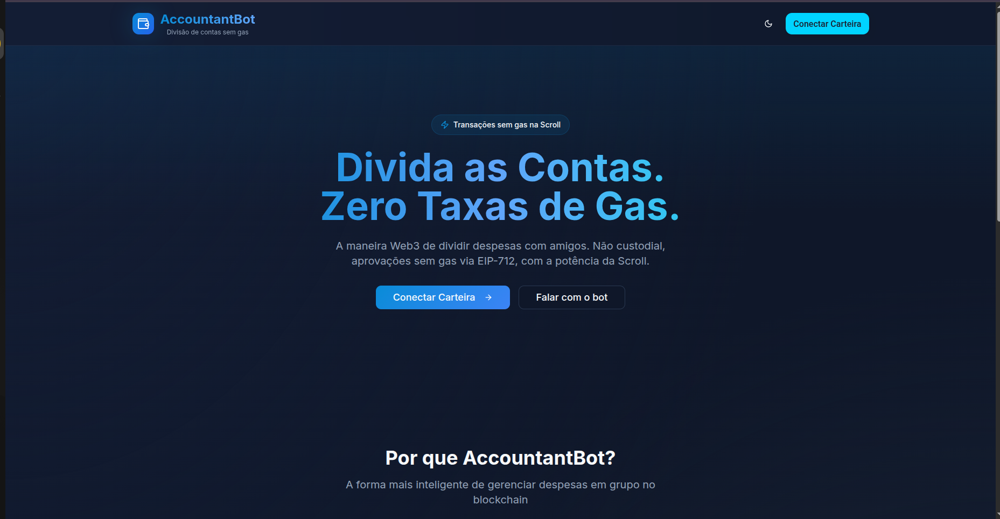
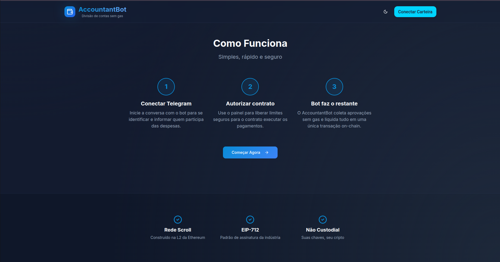
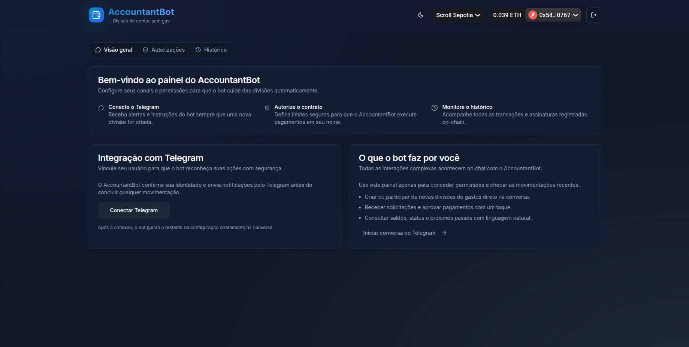
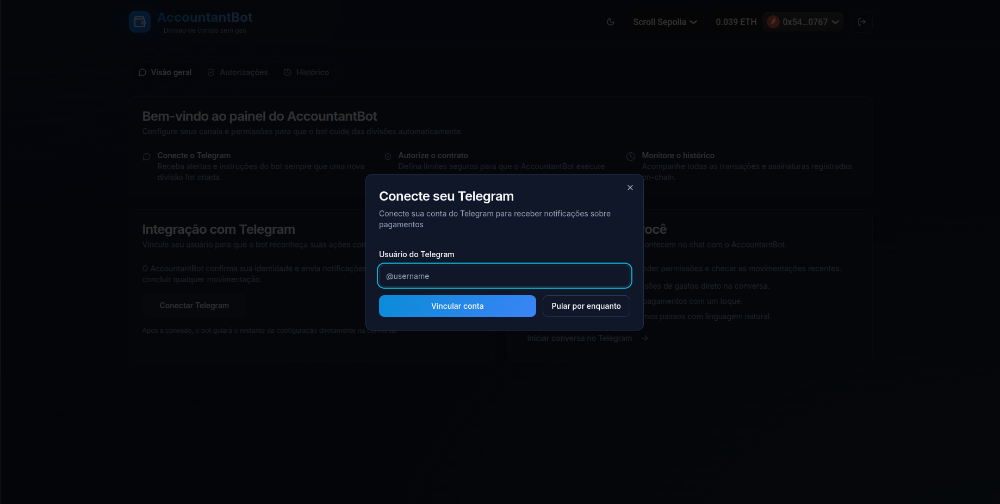
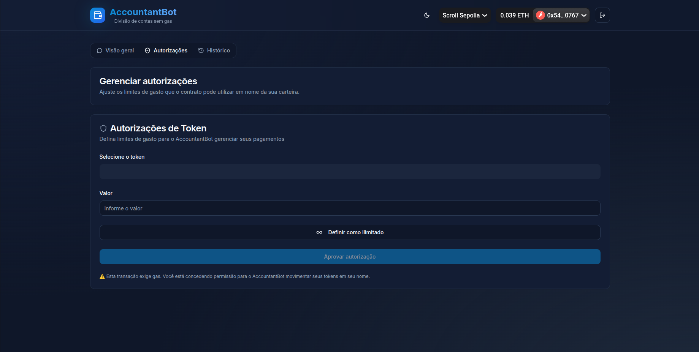
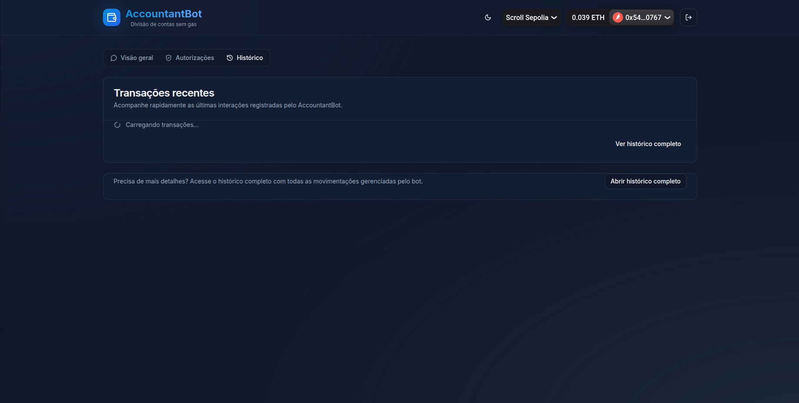
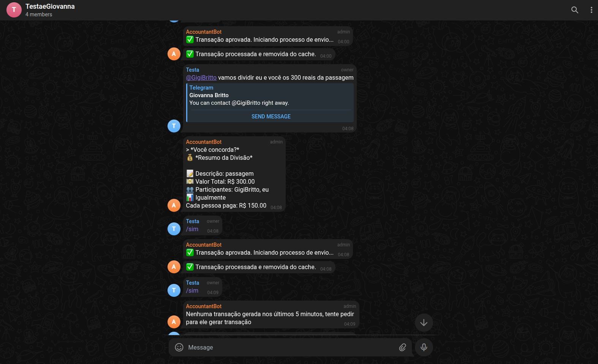
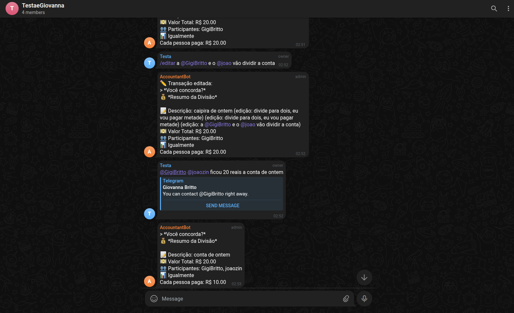

# Experiência do Usuário — AccountantBot

## 1. Visão Geral

O **AccountantBot** foi projetado para **reduzir a complexidade do Web3** e tornar o uso da blockchain **invisível para o usuário final**.  
Toda a interação é pensada para **ser tão simples quanto enviar uma mensagem no Telegram** — mas com a segurança e transparência de contratos inteligentes na Scroll.

A interface une dois mundos:
- **Front-end Web (painel de controle)** para gestão e autorizações;
- **Bot no Telegram**, onde a divisão de gastos realmente acontece.

---

## 2. Personas

### João — O organizador
- **Idade:** 25 anos  
- **Perfil:** Jovem profissional, acostumado a resolver tudo via smartphone.  
- **Motivação:** Evitar confusão na hora de dividir gastos com amigos em viagens e rolês.  
- **Dor:** Sempre sobra pra ele organizar e cobrar os outros manualmente.  
- **Objetivo:** Automatizar divisões e garantir que todos paguem sem fricção.  

> “Quero resolver as contas do grupo em dois cliques, sem ter que ser o chato que cobra todo mundo.”

---

### Giovanna — A participante
- **Idade:** 23 anos  
- **Perfil:** Universitária, não entende de blockchain.  
- **Motivação:** Quer praticidade e confiança sem precisar entender Web3.  
- **Dor:** Fica perdida em planilhas ou links de pagamento.  
- **Objetivo:** Participar das divisões sem precisar instalar apps ou criar contas novas.  

> “Eu só quero que o bot me diga quanto devo e confirme quando estiver pago.”

---

### Marcos — O entusiasta Web3
- **Idade:** 28 anos  
- **Perfil:** Early adopter, usuário de MetaMask e Telegram.  
- **Motivação:** Mostrar para amigos que Web3 pode ser útil no dia a dia.  
- **Dor:** Falta de soluções descentralizadas com boa UX.  
- **Objetivo:** Demonstrar na prática que dá pra usar crypto para resolver problemas reais.  

> “Se até minha mãe conseguir usar, aí sim é revolução.”

---

## 3. Jornada do Usuário

| Etapa | Ação | Canal | Emoção | Valor Entregue |
|-------|------|--------|---------|----------------|
| 1 | João cria um grupo no Telegram e adiciona o AccountantBot | Telegram | Curiosidade | Entrada rápida, sem burocracia |
| 2 | O bot reconhece o grupo e oferece ajuda para criar a primeira divisão | Telegram | Confiança | O bot guia o processo em linguagem natural |
| 3 | Os amigos reagem com emojis para aprovar ou editar a divisão | Telegram | Colaboração | Todos participam sem precisar sair do chat |
| 4 | O pagamento é preparado e executado via contrato Scroll | Blockchain | Surpresa positiva | “Nem percebi que usei blockchain!” |
| 5 | João acessa o painel web para revisar históricos e autorizações | Web App | Controle | Visualização centralizada e transparente |

---

## 4. Decisões de Design

### Princípio 1: Blockchain invisível
O usuário **nunca precisa entender o que é um hash, nonce ou gas**.  
A tela comunica ações humanas, não técnicas: *"Autorizar bot"*, *"Dividir conta"*, *"Confirmar gasto"*.

### Princípio 2: Conversa como interface
O Telegram é o ponto central.  
Tudo é conduzido em **linguagem natural**, e o bot responde com **mensagens ricas e emojis**, simulando uma conversa leve e amigável.

### Princípio 3: Ações rápidas e feedback imediato
Cada interação fornece feedback visual instantâneo:
- Confirmações
- Edições
- Rejeições
- Resumos

### Princípio 4: Autonomia sem risco
O painel web permite definir **limites de gasto** (por token e valor).  
Assim, o usuário mantém **controle total** sobre o que o bot pode ou não fazer em seu nome.

### Princípio 5: Identidade coesa
O design adota **tons escuros e azuis**, reforçando confiança e tecnologia.  
A tipografia é limpa e moderna, inspirada no **design system da Scroll** e no **estilo Coinbase UI**.

---

## 5. Interação e Telas do Front-End

### Tela Inicial — "Divida as Contas. Zero Taxas de Gas."

- Mensagem central clara e impactante: **proposta de valor direta**.  
- CTA duplo: “Conectar Carteira” e “Falar com o bot”.  
- Destaque: *Transações sem gas na Scroll* (apelo tecnológico e diferencial competitivo).  
- Elementos de confiança: cores frias, gradientes sutis e tipografia legível.

---

### Tela "Como Funciona"

Três passos simples:
1. **Conectar Telegram**
2. **Autorizar contrato**
3. **Bot faz o resto**

Essa estrutura reduz a curva de aprendizado e comunica que o processo é **rápido e seguro**.  
Na parte inferior, ícones reforçam credibilidade: **Scroll**, **EIP-712**, **Não Custodial**.

---

### Painel Web — Visão Geral

O painel atua como **camada de controle e confiança**:
- Integração com Telegram;  
- Autorização de contrato;  
- Histórico de transações.  

O design modular com abas (Visão geral, Autorizações, Histórico) facilita a navegação e a retenção cognitiva.

---

### 🔗 Modal de Integração com Telegram

Modal simplificado com input para `@username`.  
- Linguagem simples (“Vincular conta”)  
- Alternativa clara (“Pular por enquanto”)  
- Reforço de confiança: “Apenas para notificações de pagamento.”

---

### Autorização de Token

O usuário define **limites de gasto** para o contrato.  
- Seleciona token (ex: USDC)  
- Define valor ou marca “Ilimitado”  
- Botão primário: “Aprovar autorização”

> Este passo é o único que requer gas — e a interface explica isso claramente, evitando fricção cognitiva.

---

### Histórico de Transações

Área de consulta das últimas interações com o bot:
- Mostra status (sucesso, erro, pendente)
- Permite abrir histórico completo
- Caso não haja dados, feedback claro (“Não foi possível carregar as transações agora”)

---

## 6. Interação com o Bot (Telegram)

### Interface Conversacional

O bot foi desenvolvido com base em **UX conversacional** e **psicologia de confiança digital**:
- Linguagem humanizada  
- Emojis para reforço semântico  
- Blocos de mensagem curtos  
- Feedback imediato  

---

### Exemplo real de uso

- O bot identifica o contexto (“dividir igualmente”, “edição personalizada”).  
- Gera automaticamente o resumo da transação.  
- Usa emojis para transmitir clareza.

---

- O bot responde às alterações e confirmações com consistência.  
- Reconhece linguagem natural (“divide pra dois, eu pago metade”).  
- Atualiza o resumo dinamicamente sem precisar de comandos técnicos.

--- 

## 7. Conclusões de UX

- O **AccountantBot** entrega uma **experiência de Web3 invisível** — os usuários percebem apenas fluidez.  
- O **Telegram** atua como *interface universal de confiança*, tornando a blockchain um *plano de fundo automatizado*.  
- As decisões de design priorizam **clareza, leveza e controle**, reduzindo a fricção de adoção.

> “O usuário sente que está apenas conversando — mas na verdade está executando contratos inteligentes.”

---
